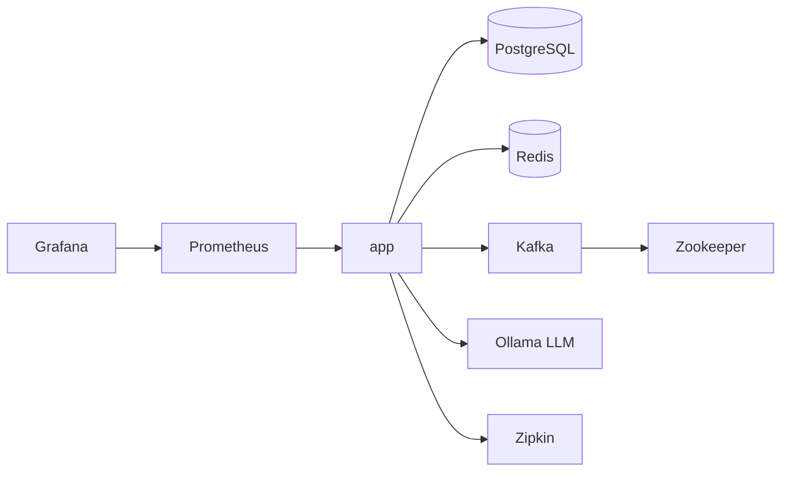

# Docker Configuration Deep Dive

Understanding the multi-stage Dockerfile and docker-compose setup.

---

## Dockerfile: Multi-Stage Build

```dockerfile
# Stage 1: Build the application
FROM maven:3.9.12-amazoncorretto-25-debian AS build
WORKDIR /app
COPY pom.xml .
RUN mvn dependency:go-offline -B    # ← Cache dependencies
COPY src ./src
RUN mvn clean package -DskipTests

# Stage 2: Extract layers
FROM eclipse-temurin:25-jre-alpine AS builder
WORKDIR /builder
COPY --from=build /app/target/*.jar application.jar
RUN java -Djarmode=layertools -jar application.jar extract

# Stage 3: Create the final image
FROM eclipse-temurin:25-jre-alpine
WORKDIR /app
RUN addgroup -S spring && adduser -S spring -G spring
USER spring:spring
COPY --from=builder /builder/dependencies/ ./
COPY --from=builder /builder/spring-boot-loader/ ./
COPY --from=builder /builder/snapshot-dependencies/ ./
COPY --from=builder /builder/application/ ./
EXPOSE 8080
ENTRYPOINT ["java", "org.springframework.boot.loader.launch.JarLauncher"]
```

---

## Stage-by-Stage Explanation

### Stage 1: Build (`maven:...`)
| Step | Command | Purpose | Cache Benefit |
|---|---|---|---|
| 1 | `COPY pom.xml .` | Copy dependency manifest | Cached if pom unchanged |
| 2 | `mvn dependency:go-offline` | Download all dependencies | **Skipped on code change** |
| 3 | `COPY src ./src` | Copy source code | Invalidates only on code change |
| 4 | `mvn package` | Compile and build JAR | Runs on code change |

**Key Insight**: Dependencies are cached separately. Changing `src/` code doesn't re-download 200MB of Maven dependencies.

### Stage 2: Layer Extraction (`eclipse-temurin:25-jre-alpine`)
Spring Boot JAR is split into layers:
- `dependencies/` - Third-party JARs (rarely change)
- `spring-boot-loader/` - Boot loader (rarely changes)
- `snapshot-dependencies/` - SNAPSHOT deps (change sometimes)
- `application/` - Your code (changes frequently)

### Stage 3: Final Image
| Line | Purpose |
|---|---|
| `alpine` base | Tiny image (~50MB vs ~200MB for debian) |
| `adduser spring` | Non-root user (security best practice) |
| `COPY --from=builder` | Only copy extracted layers (no build tools) |

---

## Cache Scenarios

| What Changed | Steps Run | Time Saved |
|---|---|---|
| Only Java code | Stage 1 step 4, Stage 2-3 | ~60s (deps cached) |
| Only pom.xml | All of Stage 1, Stage 2-3 | ~20s (base cached) |
| Dockerfile | Everything | 0s |
| Nothing | Nothing (cached) | ~90s |

---

## Image Size Comparison

| Approach | Final Size |
|---|---|
| Fat JAR in JDK image | ~600MB |
| Fat JAR in JRE alpine | ~200MB |
| **Layered in JRE alpine** | **~180MB** |

---

## Docker Compose Architecture

```yaml
services:
  db:         # PostgreSQL with pgvector
  redis:      # Caching layer
  kafka:      # Message broker
  zookeeper:  # Kafka coordinator
  ollama:     # LLM service
  prometheus: # Metrics collection
  grafana:    # Visualization
  zipkin:     # Distributed tracing
  app:        # Your application
```

### Service Dependencies


### Health Checks
```yaml
healthcheck:
  test: ["CMD", "pg_isready", "-U", "postgres"]
  interval: 10s
  timeout: 5s
  retries: 5
```

**Why?**
- `depends_on.condition: service_healthy` waits for actual readiness
- Prevents "connection refused" errors on startup

### Environment Variables
```yaml
environment:
  SPRING_DATASOURCE_URL: jdbc:postgresql://db:5432/datahub
  SPRING_KAFKA_BOOTSTRAP_SERVERS: kafka:29092
  SPRING_DATA_REDIS_HOST: redis
```
Uses Docker DNS (`db`, `kafka`, `redis`) for service discovery.

---

## Common Docker Commands

```bash
# Start everything
docker compose up -d --build

# View logs
docker logs -f social-distro-backend

# Rebuild only app (after code change)
docker compose up -d --build app

# Clean restart (removes volumes)
docker compose down -v && docker compose up -d --build

# Shell into container
docker exec -it social-distro-backend sh

# View image layers
docker history social-distro-app
```
