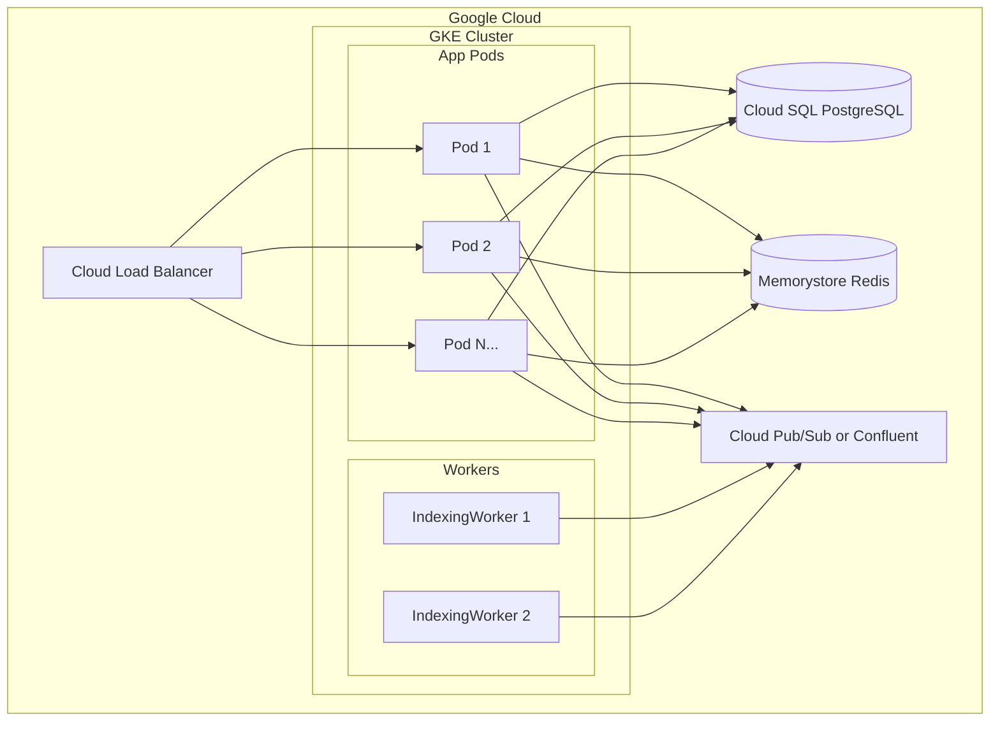

# Kubernetes Deployment Guide

Scaling from 1 to 30 instances on Google Cloud.

---

## Architecture Overview



---

## Kubernetes Manifests

### 1. Deployment (App)
```yaml
# k8s/deployment.yaml
apiVersion: apps/v1
kind: Deployment
metadata:
  name: social-distro
spec:
  replicas: 10  # Scale to 10, 20, 30 as needed
  selector:
    matchLabels:
      app: social-distro
  template:
    metadata:
      labels:
        app: social-distro
    spec:
      containers:
        - name: app
          image: gcr.io/YOUR_PROJECT/social-distro:latest
          ports:
            - containerPort: 8080
          resources:
            requests:
              memory: "512Mi"
              cpu: "250m"
            limits:
              memory: "1Gi"
              cpu: "1000m"
          env:
            - name: SPRING_DATASOURCE_URL
              valueFrom:
                secretKeyRef:
                  name: db-credentials
                  key: url
          readinessProbe:
            httpGet:
              path: /actuator/health/readiness
              port: 8080
            initialDelaySeconds: 30
            periodSeconds: 10
          livenessProbe:
            httpGet:
              path: /actuator/health/liveness
              port: 8080
            initialDelaySeconds: 60
            periodSeconds: 30
```

### 2. Service
```yaml
# k8s/service.yaml
apiVersion: v1
kind: Service
metadata:
  name: social-distro
spec:
  selector:
    app: social-distro
  ports:
    - port: 80
      targetPort: 8080
  type: ClusterIP
```

### 3. Ingress (Load Balancer)
```yaml
# k8s/ingress.yaml
apiVersion: networking.k8s.io/v1
kind: Ingress
metadata:
  name: social-distro
  annotations:
    kubernetes.io/ingress.class: "gce"
spec:
  rules:
    - host: api.yourdomain.com
      http:
        paths:
          - path: /
            pathType: Prefix
            backend:
              service:
                name: social-distro
                port:
                  number: 80
```

### 4. Horizontal Pod Autoscaler
```yaml
# k8s/hpa.yaml
apiVersion: autoscaling/v2
kind: HorizontalPodAutoscaler
metadata:
  name: social-distro
spec:
  scaleTargetRef:
    apiVersion: apps/v1
    kind: Deployment
    name: social-distro
  minReplicas: 10
  maxReplicas: 30
  metrics:
    - type: Resource
      resource:
        name: cpu
        target:
          type: Utilization
          averageUtilization: 70
    - type: Resource
      resource:
        name: memory
        target:
          type: Utilization
          averageUtilization: 80
```

---

## GKE Deployment Steps

### 1. Create GKE Cluster
```bash
gcloud container clusters create social-distro-cluster \
  --num-nodes=5 \
  --machine-type=e2-standard-4 \
  --zone=us-central1-a \
  --enable-autoscaling \
  --min-nodes=3 \
  --max-nodes=10
```

### 2. Build & Push Image
```bash
# Configure Docker for GCR
gcloud auth configure-docker

# Build and push
docker build -t gcr.io/YOUR_PROJECT/social-distro:v1.0 .
docker push gcr.io/YOUR_PROJECT/social-distro:v1.0
```

### 3. Deploy
```bash
kubectl apply -f k8s/
kubectl get pods -w  # Watch rollout
```

---

## Scaling Strategy

### Instance Sizing
| Load | Replicas | Node Type | Estimated Cost |
|---|---|---|---|
| Dev/Test | 2 | e2-small | $50/month |
| 10 instances | 10 | e2-standard-2 | $300/month |
| 20 instances | 20 | e2-standard-4 | $800/month |
| 30 instances | 30 | e2-standard-4 | $1200/month |

### What Scales Independently
| Component | Scaling Method |
|---|---|
| App (API) | HPA based on CPU/memory |
| Kafka Consumers | Increase `concurrency` or pod count |
| LLM (Ollama) | Separate node pool with GPUs |
| Database | Cloud SQL read replicas |
| Redis | Memorystore cluster mode |

---

## Managed Services (Recommended for Production)

| Component | GCP Service | Why |
|---|---|---|
| PostgreSQL | Cloud SQL | Automated backups, HA |
| Redis | Memorystore | Sub-ms latency, auto-failover |
| Kafka | Pub/Sub or Confluent Cloud | Managed, infinite scale |
| LLM | Vertex AI | No GPU management |

---

## Security Best Practices

```yaml
# Pod Security Context
securityContext:
  runAsNonRoot: true
  runAsUser: 1000
  readOnlyRootFilesystem: true

# Network Policy
apiVersion: networking.k8s.io/v1
kind: NetworkPolicy
metadata:
  name: deny-all
spec:
  podSelector: {}
  policyTypes:
    - Ingress
    - Egress
```

---

## Quick Commands

```bash
# Scale manually
kubectl scale deployment social-distro --replicas=20

# Check HPA status
kubectl get hpa

# View logs
kubectl logs -f deployment/social-distro

# Rolling update
kubectl set image deployment/social-distro app=gcr.io/PROJECT/social-distro:v2.0

# Rollback
kubectl rollout undo deployment/social-distro
```
