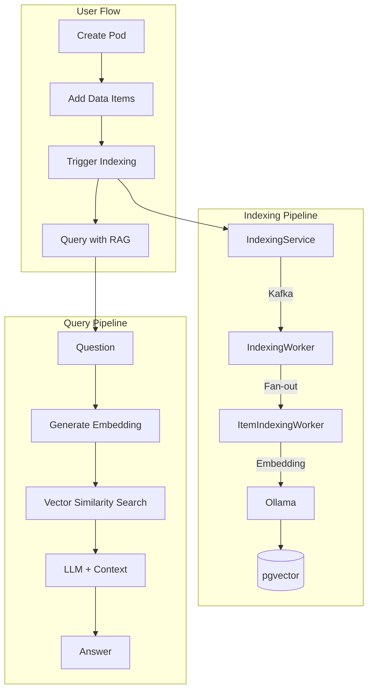
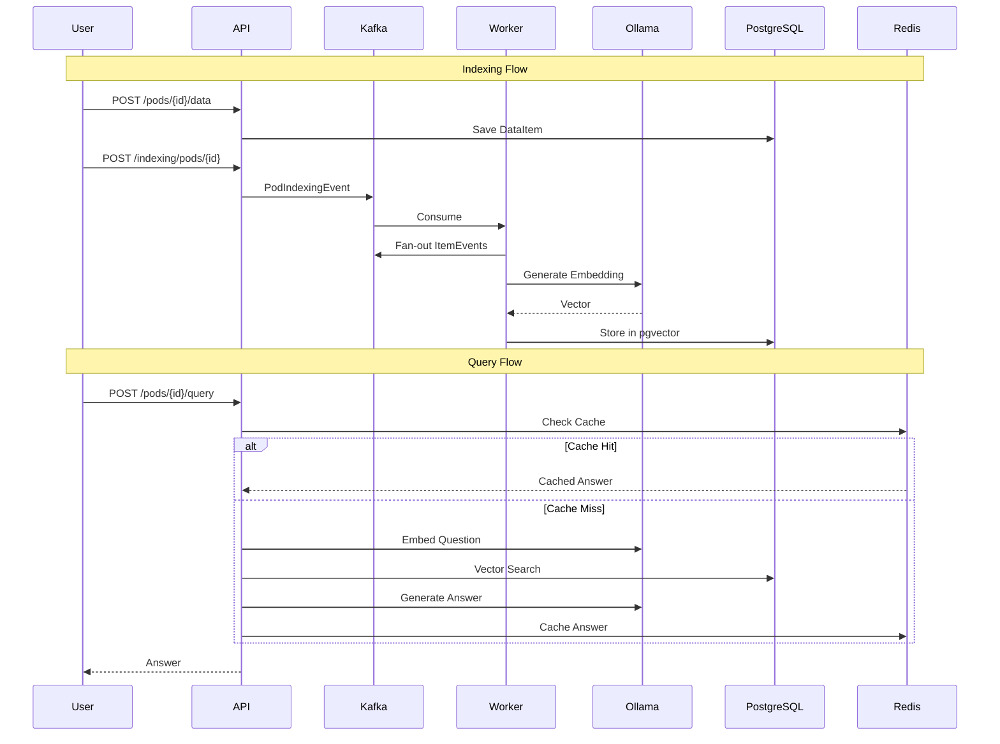

# App Summary & Roadmap

## Product Vision


## Application Flow



## Data Flow



---

## Market Success Roadmap

### Phase 1: Core Product (✅ Done)
- [x] Pod-based data organization
- [x] Async indexing with Kafka
- [x] RAG query with vector search
- [x] Resilience (circuit breaker, retries)
- [x] Observability (Prometheus, Grafana, Zipkin)

### Phase 2: User Experience
| Feature | Impact |
|---|---|
| **Web UI** | Dashboard for managing pods, uploading files, querying |
| **File Upload** | PDF, DOCX, TXT ingestion with chunking |
| **Chat Interface** | Conversational RAG with history |
| **Real-time Progress** | WebSocket for indexing status |

### Phase 3: Enterprise Features
| Feature | Value Proposition |
|---|---|
| **Multi-tenancy** | Isolated data per organization |
| **RBAC** | Role-based access control |
| **SSO** | SAML/OIDC integration |
| **Audit Logs** | Compliance tracking |
| **Data Encryption** | At-rest and in-transit |

### Phase 4: AI Enhancements
| Feature | Technology |
|---|---|
| **Multi-model Support** | OpenAI, Anthropic, Gemini, local Ollama |
| **Hybrid Search** | Vector + keyword (BM25) |
| **Agentic RAG** | Tool use, multi-step reasoning |
| **Citations** | Source attribution in answers |
| **Summarization** | Auto-generate pod summaries |

### Phase 5: Scale & Distribution
| Feature | Benefit |
|---|---|
| **Multi-region** | Low latency globally |
| **Edge Deployment** | On-prem for sensitive data |
| **Usage Analytics** | Query insights, popular topics |
| **API Rate Limiting** | Fair usage, monetization |

---

## Competitive Differentiators

| Differentiator | Description |
|---|---|
| **Open Source Core** | Self-hostable, no vendor lock-in |
| **Model Agnostic** | Use any LLM (local or cloud) |
| **Developer-First** | Clean API, comprehensive docs |
| **Event-Driven** | Scales to millions of documents |
| **Observable by Default** | Built-in Prometheus metrics |

---

## Tech Stack Summary

```
┌─────────────────────────────────────────────────────────┐
│                    API Layer (REST)                     │
├─────────────────────────────────────────────────────────┤
│  Spring Boot 4 │ Virtual Threads │ Hexagonal Arch       │
├─────────────────────────────────────────────────────────┤
│       Kafka (Events)    │    Redis (Cache)              │
├─────────────────────────────────────────────────────────┤
│  PostgreSQL + pgvector  │     Ollama (LLM)              │
├─────────────────────────────────────────────────────────┤
│  Prometheus │ Grafana │ Zipkin │ Liquibase              │
└─────────────────────────────────────────────────────────┘
```
