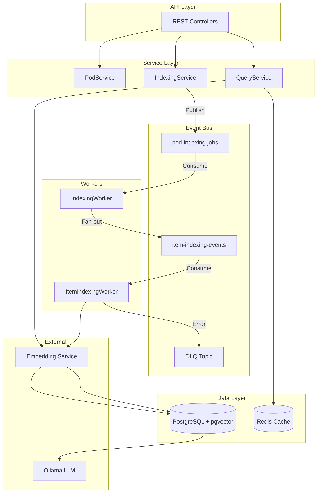
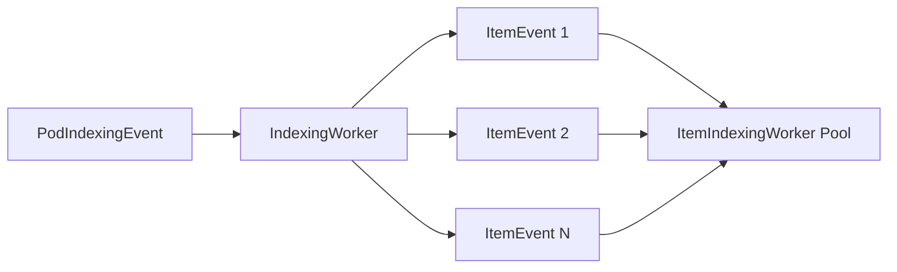

# System Design Document: Social Distro

A deep dive into the modern system design principles applied in this project.

---

## 1. Architecture Overview



**Pattern**: Hexagonal (Ports & Adapters) + Event-Driven Microservice

---

## 2. Distributed Systems Concepts

### 2.1 Event-Driven Architecture (Kafka)

| Aspect | Implementation | Code Reference |
|---|---|---|
| Message Broker | Apache Kafka | [docker-compose.yml:kafka](file:///c:/Users/rsrsr/IdeaProjects/social-distro/docker-compose.yml) |
| Producer | `KafkaTemplate<String, Object>` | [IndexingService.java:44](file:///c:/Users/rsrsr/IdeaProjects/social-distro/src/main/java/com/raghav/datahub/service/indexing/IndexingService.java#L44) |
| Consumer | `@KafkaListener` | [IndexingWorker.java:37](file:///c:/Users/rsrsr/IdeaProjects/social-distro/src/main/java/com/raghav/datahub/service/indexing/IndexingWorker.java#L37) |

**Why Kafka?**
- **Durability**: Messages persist on disk, surviving broker restarts.
- **Ordering**: Per-partition ordering guarantees (we use `item.getId()` as key).
- **Scalability**: Horizontal scaling via partitions.

**Tradeoffs**:
| Pros | Cons |
|---|---|
| High throughput | Operational complexity |
| Replay capability | Eventually consistent |
| Decoupled producers/consumers | Requires Zookeeper (legacy) or KRaft |

**Alternatives**:
- **RabbitMQ**: Better for routing, lower latency, but less throughput.
- **AWS SQS/SNS**: Managed, but vendor lock-in.
- **Pulsar**: Unified queue + stream, but newer ecosystem.

---

### 2.2 Fan-Out Pattern (Scalability)

**Problem**: A single indexing job for a pod with 10,000 items blocks the worker.

**Solution**: Fan-out architecture splits one job into N item events.



| Aspect | Code Reference |
|---|---|
| Fan-out logic | [IndexingWorker.java:77-85](file:///c:/Users/rsrsr/IdeaProjects/social-distro/src/main/java/com/raghav/datahub/service/indexing/IndexingWorker.java#L77-85) |
| Parallel consumption | [ItemIndexingWorker.java:33 (concurrency=5)](file:///c:/Users/rsrsr/IdeaProjects/social-distro/src/main/java/com/raghav/datahub/service/indexing/ItemIndexingWorker.java#L33) |

**Tradeoffs**:
| Pros | Cons |
|---|---|
| Parallel processing | Harder to track overall job completion |
| Better resource utilization | Increased Kafka traffic |
| Fault isolation (one item fails, others continue) | Need idempotency |

---

### 2.3 Partitioning & Ordering

**Strategy**: Use `dataItemId` as Kafka message key.

```java
kafkaTemplate.send("item-indexing-events", item.getId(), itemEvent);
```

**Effect**: All events for the same item go to the same partition → **ordered processing per item**.

**CAP Theorem Implication**:
- We choose **AP** (Availability + Partition Tolerance) over strict Consistency.
- Eventual consistency: item may be processed after job marked "COMPLETED".

---

## 3. Concurrency Control

### 3.1 Optimistic Locking

**Problem**: Two Kafka consumers update the same job status simultaneously → lost update.

**Solution**: `@Version` field on JPA entities.

| Entity | Code Reference |
|---|---|
| PodEntity | [PodEntity.java:28-29](file:///c:/Users/rsrsr/IdeaProjects/social-distro/src/main/java/com/raghav/datahub/infrastructure/persistence/entity/PodEntity.java#L28-29) |
| IndexingJobEntity | [IndexingJobEntity.java:41-42](file:///c:/Users/rsrsr/IdeaProjects/social-distro/src/main/java/com/raghav/datahub/infrastructure/persistence/entity/IndexingJobEntity.java#L41-42) |

**How it works**:
1. Entity loaded with `version = 5`.
2. On save, JPA generates: `UPDATE ... WHERE id = ? AND version = 5`.
3. If another transaction updated it first (version = 6), query affects 0 rows → `OptimisticLockException`.

**Tradeoffs**:
| Pros | Cons |
|---|---|
| No database locks held | Requires retry logic on conflict |
| High concurrency | Not suitable for high-contention scenarios |

**Alternatives**:
- **Pessimistic Locking**: `SELECT ... FOR UPDATE`. Guarantees exclusivity but reduces throughput.
- **Distributed Locks (Redis)**: For cross-service locking.

---

### 3.2 Atomic Status Transitions

**Problem**: Two workers read `PENDING`, both set `RUNNING`.

**Solution**: Conditional update query.

```java
@Query("UPDATE IndexingJobEntity j SET j.status = :new WHERE j.jobId = :id AND j.status = :expected")
int updateStatusConditionally(...);
```

| Code Reference |
|---|
| [JpaIndexingJobSpringRepository.java:17-19](file:///c:/Users/rsrsr/IdeaProjects/social-distro/src/main/java/com/raghav/datahub/infrastructure/persistence/repository/JpaIndexingJobSpringRepository.java#L17-19) |

---

### 3.3 Idempotency

**Problem**: Kafka redelivers a message → duplicate vector chunk created.

**Solution**: Deterministic ID based on business key.

```java
chunk.setId(event.getPodId() + ":" + event.getDataItemId());
```

| Code Reference |
|---|
| [ItemIndexingWorker.java:57-58](file:///c:/Users/rsrsr/IdeaProjects/social-distro/src/main/java/com/raghav/datahub/service/indexing/ItemIndexingWorker.java#L57-58) |

**Alternatives**:
- **Idempotency Key Header**: Store processed keys in Redis with TTL.
- **Exactly-Once Semantics**: Kafka Transactions (heavier).

---

## 4. Resilience Patterns

### 4.1 Circuit Breaker

**Problem**: Ollama is down → cascading failures, thread pool exhaustion.

**Solution**: Resilience4j Circuit Breaker.

```java
@CircuitBreaker(name = "llm", fallbackMethod = "generateFallback")
public String generateAnswer(String prompt) { ... }
```

| Aspect | Code Reference |
|---|---|
| Implementation | [OllamaLlmClient.java:20-21](file:///c:/Users/rsrsr/IdeaProjects/social-distro/src/main/java/com/raghav/datahub/service/llm/OllamaLlmClient.java#L20-21) |
| Configuration | [application.yaml:4-15](file:///c:/Users/rsrsr/IdeaProjects/social-distro/src/main/resources/application.yaml#L4-15) |

**State Machine**:
```
CLOSED → (failures > threshold) → OPEN → (wait) → HALF_OPEN → (success) → CLOSED
```

**Tradeoffs**:
| Pros | Cons |
|---|---|
| Fast failure | Requires tuning thresholds |
| Prevents cascading failures | Fallback may return stale/default data |

---

### 4.2 Dead Letter Queue (DLQ)

**Problem**: Poison pill messages block consumer.

**Solution**: On failure, send to DLQ topic.

```java
kafkaTemplate.send(DLQ_TOPIC, rawJson);
```

| Code Reference |
|---|
| [ItemIndexingWorker.java:42-43](file:///c:/Users/rsrsr/IdeaProjects/social-distro/src/main/java/com/raghav/datahub/service/indexing/ItemIndexingWorker.java#L42-43) |

---

## 5. Caching (Redis)

### 5.1 LLM Response Cache

**Problem**: Same prompt → expensive LLM call repeated.

**Solution**: `@Cacheable` with Redis backend.

```java
@Cacheable(value = "llm_responses", key = "#prompt")
public String generateAnswer(String prompt) { ... }
```

| Aspect | Code Reference |
|---|---|
| Cache Config | [CacheConfig.java](file:///c:/Users/rsrsr/IdeaProjects/social-distro/src/main/java/com/raghav/datahub/config/CacheConfig.java) |
| Usage | [OllamaLlmClient.java:21](file:///c:/Users/rsrsr/IdeaProjects/social-distro/src/main/java/com/raghav/datahub/service/llm/OllamaLlmClient.java#L21) |

**Why Redis over Local Cache?**
- **Distributed**: Multiple app instances share cache.
- **Persistence**: Optional RDB/AOF snapshots.

**Tradeoffs**:
| Pros | Cons |
|---|---|
| Low latency (sub-ms) | Network hop |
| Shared across instances | Cache invalidation complexity |

---

## 6. Vector Search & Semantic Retrieval

### 6.1 pgvector

**Choice**: PostgreSQL extension for vector similarity search.

| Aspect | Code Reference |
|---|---|
| Entity | [VectorChunkEntity.java](file:///c:/Users/rsrsr/IdeaProjects/social-distro/src/main/java/com/raghav/datahub/infrastructure/persistence/entity/VectorChunkEntity.java) |
| Query | [VectorChunkRepository.java:12](file:///c:/Users/rsrsr/IdeaProjects/social-distro/src/main/java/com/raghav/datahub/infrastructure/persistence/repository/VectorChunkRepository.java#L12) |

```sql
SELECT * FROM vector_chunks ORDER BY embedding <-> :embedding LIMIT :limit
```

**Why pgvector?**
- **Unified data layer**: No separate vector DB.
- **Transactional**: ACID guarantees with regular data.

**Tradeoffs**:
| Pros | Cons |
|---|---|
| Simpler ops (one DB) | Less optimized than dedicated vector DBs |
| ACID | Scales vertically |

**Alternatives**:
- **Pinecone**: Managed, highly scalable.
- **Milvus/Weaviate**: Open-source, feature-rich.
- **Elasticsearch/OpenSearch**: Hybrid text + vector.

---

## 7. API Design

### 7.1 RESTful Endpoints

| Endpoint | Method | Purpose |
|---|---|---|
| `/pods` | POST | Create pod |
| `/pods/{id}/data` | POST | Add data item |
| `/indexing/pods/{id}` | POST | Start indexing job |
| `/indexing/jobs/{id}` | GET | Get job status |
| `/pods/{id}/query` | POST | RAG query |

| Code Reference |
|---|
| [PodController.java](file:///c:/Users/rsrsr/IdeaProjects/social-distro/src/main/java/com/raghav/datahub/web/controller/PodController.java) |
| [QueryController.java](file:///c:/Users/rsrsr/IdeaProjects/social-distro/src/main/java/com/raghav/datahub/web/controller/QueryController.java) |

### 7.2 Async Job Pattern

Indexing is long-running → return job ID immediately, poll for status.

```
POST /indexing/pods/{id} → { "jobId": "abc" }
GET /indexing/jobs/abc → { "status": "RUNNING" }
```

---

## 8. Schema Evolution (Liquibase)

**Problem**: Schema changes must be versioned and repeatable.

**Solution**: Liquibase SQL migrations.

| Aspect | Code Reference |
|---|---|
| Changelog | [db.changelog-master.yaml](file:///c:/Users/rsrsr/IdeaProjects/social-distro/src/main/resources/db/changelog/db.changelog-master.yaml) |
| Initial Schema | [001-initial-schema.sql](file:///c:/Users/rsrsr/IdeaProjects/social-distro/src/main/resources/db/changelog/changes/001-initial-schema.sql) |
| Version Columns | [003-add-version-columns.sql](file:///c:/Users/rsrsr/IdeaProjects/social-distro/src/main/resources/db/changelog/003-add-version-columns.sql) |

**Why Liquibase?**
- **Version control for DB**: Every change tracked.
- **Rollback support**.

**Alternatives**: Flyway (simpler), manual scripts (risky).

---

## 9. Hexagonal Architecture

**Pattern**: Ports (interfaces) and Adapters (implementations).

```
Domain Layer (core)
    ├── model/          # Pod, DataItem, IndexingJob
    ├── repository/     # PodRepository (interface = port)
    └── port/           # VectorStore (interface)

Infrastructure Layer
    └── persistence/
        ├── adapter/    # PgVectorStore (implements VectorStore)
        └── repository/ # JpaPodRepositoryAdapter (implements PodRepository)
```

| Port | Adapter | Code Reference |
|---|---|---|
| VectorStore | PgVectorStore | [VectorStore.java](file:///c:/Users/rsrsr/IdeaProjects/social-distro/src/main/java/com/raghav/datahub/domain/port/VectorStore.java), [PgVectorStore.java](file:///c:/Users/rsrsr/IdeaProjects/social-distro/src/main/java/com/raghav/datahub/infrastructure/persistence/adapter/PgVectorStore.java) |

**Why?**
- **Testability**: Mock ports in unit tests.
- **Flexibility**: Swap pgvector for Pinecone without changing domain.

---

## 10. Future Extensibility

| Feature | Design Provision |
|---|---|
| Multi-model support | `model_version` column in `vector_chunks` |
| User clustering | `VectorStore.findByPodId()` for pod-level embeddings |
| Horizontal scaling | Stateless workers, Kafka partitioning |
| Cloud deployment | Docker + externalized config |

---

## 11. Observability

| Metric | Code Reference |
|---|---|
| `indexing.item.process` | [ItemIndexingWorker.java:62](file:///c:/Users/rsrsr/IdeaProjects/social-distro/src/main/java/com/raghav/datahub/service/indexing/ItemIndexingWorker.java#L62) |
| Circuit breaker state | Resilience4j auto-exports to Prometheus |
| Endpoint: `/actuator/prometheus` | [application.yaml:36-40](file:///c:/Users/rsrsr/IdeaProjects/social-distro/src/main/resources/application.yaml#L36-40) |

---

## 12. Summary Matrix

| Concept | Implementation | Alternative |
|---|---|---|
| Message Queue | Kafka | RabbitMQ, SQS |
| Scalability | Fan-out + Partitioning | Sharding, CQRS |
| Concurrency | Optimistic Locking | Pessimistic, Redis Locks |
| Caching | Redis | Caffeine, Memcached |
| Vector Search | pgvector | Pinecone, Milvus |
| Resilience | Circuit Breaker + DLQ | Bulkhead, Rate Limiting |
| Schema | Liquibase | Flyway |
| Architecture | Hexagonal | Clean, Onion |
